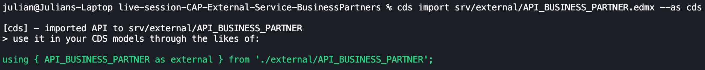

# 🔌 01 – External Service

This branch initializes the integration of the external SAP S/4HANA OData service API_BUSINESS_PARTNER into the CAP project.

In this step, we import the external EDMX definition and generate the corresponding CDS model.

⚠️ The service is not yet exposed or executed.

---

## 🎯 Objectives of This Step

- Import external OData service (EDMX)
- Convert EDMX to CDS
- Prepare project for external consumption

---

## 🗂 Relevant Files

```
srv/external/
├── API_BUSINESS_PARTNER.edmx
└── API_BUSINESS_PARTNER.cds
```

---

## 🌐 External Service Import

The import was executed using:

```
cds import srv/external/API_BUSINESS_PARTNER.edmx --as cds
```

CAP generated the CDS representation of the OData service.

---

## 📸 Result



**Description:**

The above screenshot shows the successfully imported external service model inside the CAP project structure.

- EDMX file converted to CDS
- External namespace available
- No service exposure yet

---

## 🧠 What You Learned

- How to import external OData services
- How CAP transforms EDMX to CDS
- How to prepare external integration