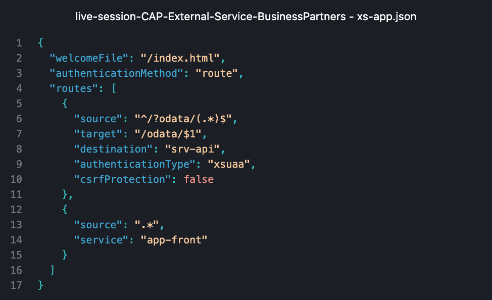

# 🚀 11 – Add Application Frontend

This branch prepares the CAP project for deployment to Application Frontend.

---

## 🎯 Objectives

- Add xs-app.json
- Adjust mta.yaml
- Adjust ui5.yaml
- Adjust package.json files

---

## 🗂 Relevant Files

```
mta.yaml
package.json
app/business-partners-example/package.json
app/business-partners-example/ui5.yaml
app/business-partners-example/xs-app.json
```

---

## 📸 Screenshots

### xs-app.json added



**Description:**

Shows the created `xs-app.json` defining the routes.

---

## 🧠 What You Learned

- What xs-app.json is
- How Application Frontend work
