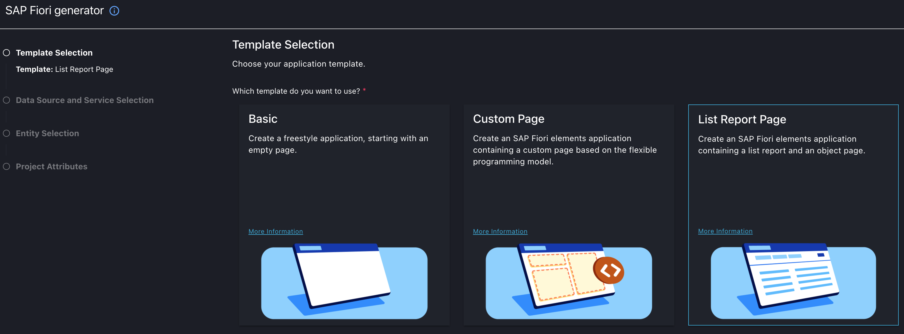
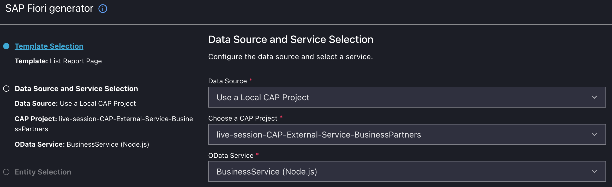
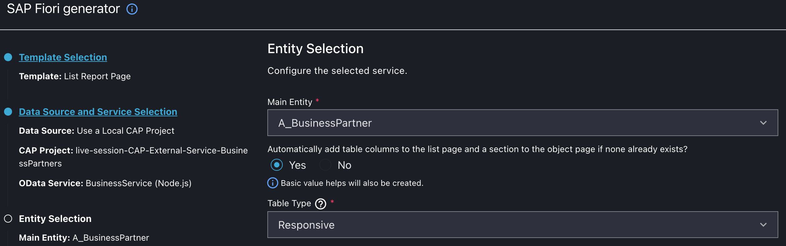
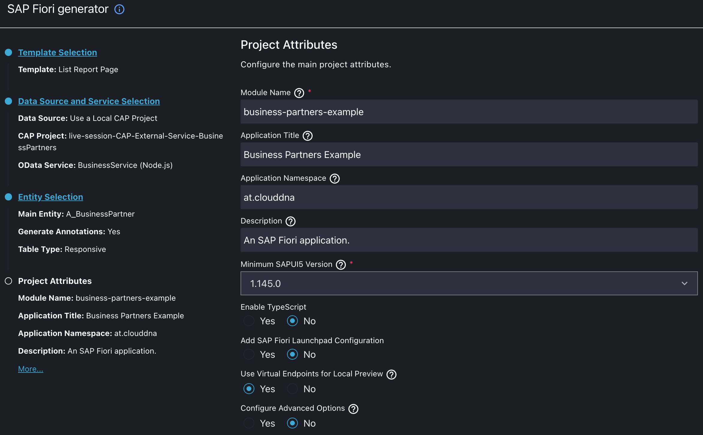

# 🖥 05 – Add UI (SAPUI5 / Fiori)

This branch adds a SAPUI5/Fiori frontend application to the deployed CAP backend.

---

## 🎯 Objectives

- Add UI module
- Bind to OData V4 service
- Provide full-stack integration

---

## 🗂 Relevant Files

```
app/business-partner-example/
```

---

## 📸 Screenshots

### 1️⃣ Application Launch










---

## 🔄 Full Architecture

Browser  
→ SAPUI5 App  
→ CAP Service (BTP)  
→ Destination  
→ External SAP Business Partner API  

---

## 🧠 What You Learned

- How to add UI to CAP
- How to bind UI5 to OData
- How full-stack CAP applications work