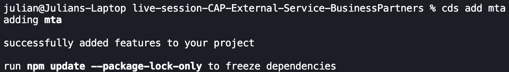

# 🚀 10 – Add MTA File for Deployment

This branch prepares the CAP project for deployment to SAP BTP using an MTA descriptor.

---

## 🎯 Objectives

- Add mta.yaml
- Define modules and resources

---

## 🗂 Relevant Files

```
mta.yaml
```

---

## 📸 Screenshots

### MTA File Added



**Description:**

Shows the created `mta.yaml` defining modules and required resources.

---

## 🧠 What You Learned

- What an MTA is
- How deployment descriptors work