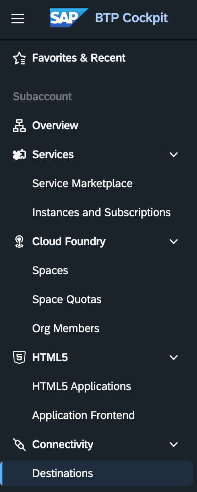
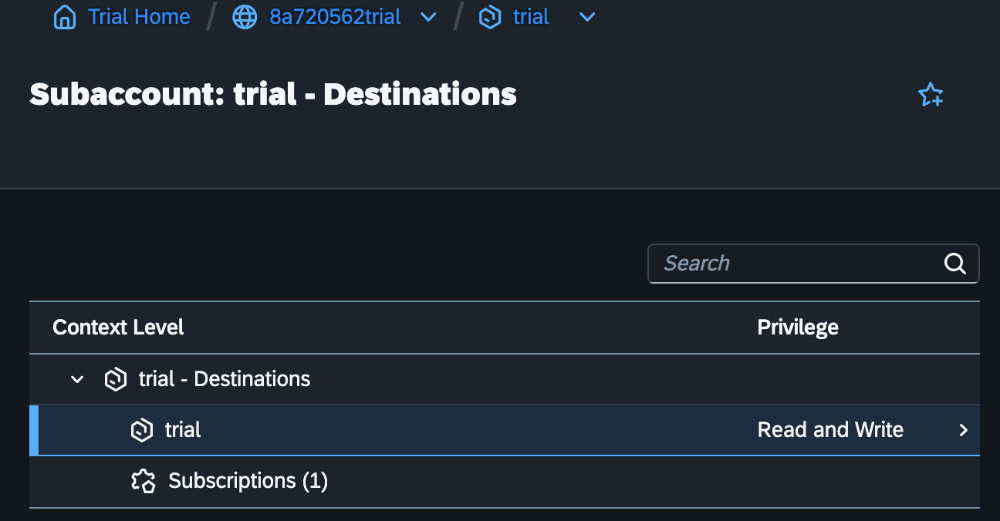
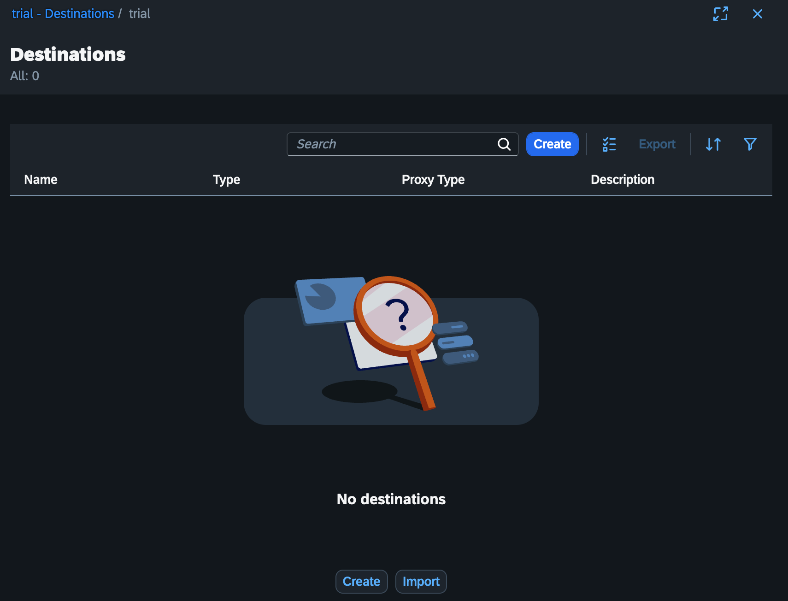
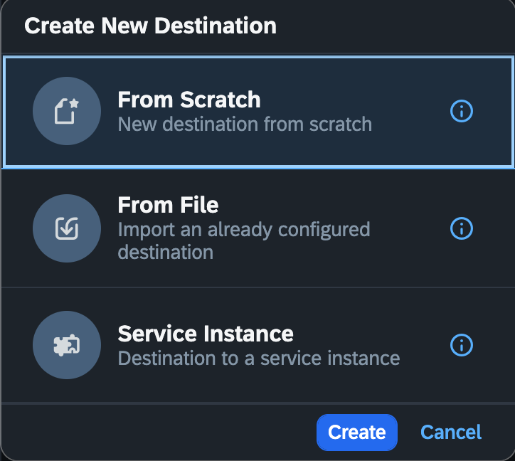
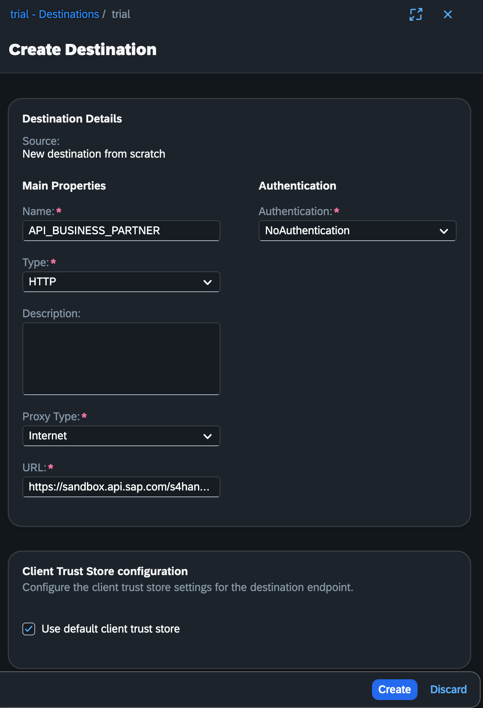

# 🔐 09 – Create Destination in SAP BTP Subaccount

This branch configures secure outbound connectivity using SAP BTP Destination service.

---

## 🎯 Objectives

- Configure Destination in BTP
- Adjust security configuration
- Enable secure external API access

---

## 📸 Screenshots

### 1️⃣ Destination Configuration

These screenshots document the complete destination setup process.

---

## 🧠 What You Learned

- How to configure Destinations
- How CAP connects via Destination
- How secure outbound connectivity works